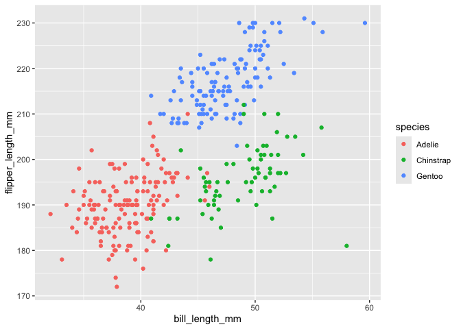

sjt2164 Homework 1
================

## Question 1

*This question uses the `tidyverse` library and the `Penguins` dataset.
The codes for loading the library and the dataset are hidden using
`include = FALSE`.*

**Summary of Dataset**

The `Penguins` dataset (8 columns x 344 rows), contains data on 344
penguins with the following variables:

- **Factor variables** include `species` (Adelie, Chinstrap, Gentoo),
  `island` (Biscoe, Dream, Torgersen), `year` (2007 - 2009), and `sex`
  (female, male).
- **Numeric variables** include doubles (`bill_length_mm` and
  `bill_depth_mm`) and integers (`body_mass_g` and `flipper_length_mm`).

Using the `summary(penguins)` code, we also see that there are several
“NA” values in the dataset. Each of the numberic variables listed above
had 2 NA values. 11 of the 344 penguins had NA values for `sex`.

Body mass is measured in grams and ranges from 2700g to 6300g with a
mean of 4201.75g. Bill length (min: 32.1, max: 59.6, mean: 43.92), bill
depth (min: 13.1, max: 21.5, mean: 17.15), and flipper length (min: 172,
max: 231, mean: 200.92) are all measured in millimeters.

**Penguins Scatterplot**

*Note: The code, messages, and any warning notices are hidden using
`echo = FALSE`, `message = FALSE`, and `warning = FALSE`. Only the
scatterplot is shown below.*

Using the `Penguins` dataset, a scatterplot is generated below using
`ggplot() + geom_point()`. The distribution of penguin species is shown
bellow with `flipper_length_mm` as the y-variable and `bill_length_mm`
as the x-variable. Each penguin species is represented by a different
color as depicted in the key of the scatterplot.

Since 2 penguins had “NA” values for both `flipper_length_mm` and
`bill_length_mm`, they are excluded. Thus, the scatterplot contains data
for a total of 342 penguins.

The scatterplot is exported using `ggsave`.

**Scatterplot (n = 342)**

<!-- -->

## Question 2

The code below shows how the data frame `question2_df` is constructed.
This data frame consists of the following variables:

- `sample_value` = a random sample of size 10 from a standard Normal
  distribution
- `value_greater_than_0` = a logical vector that indicates whether
  elements of `sample_value` are greater than 0
- `nycity_names` = a character vector of length 10
- `top_industries` = a factor vector of length 10 containing 3 levels
  (`entertainment`, `healthcare`, and `technology`).

``` r
question2_df = 
    tibble(
      sample_value = rnorm(10),
      value_greater_than_0 = ifelse(sample_value > 0, "Yes", "No"),
      nycity_names = c("Nyc", "Buffalo", "Rochester", "Yonkers", "Syracuse", "Albany", "New Rochelle", "Schenectady", "Utica", "Mount_Vernon"),
      top_industries = factor(c("entertainment", "healthcare", "technology", "healthcare", "healthcare", "healthcare", "technology", "technology", "technology", "healthcare"))
    )
```
